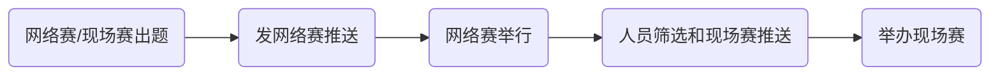
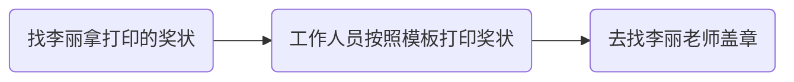

# IT节程序设计竞赛简介

IT节程序设计竞赛是我校举办了十九届的一项传统活动,一般由信息技术学院主办,软件工程系,程序设计爱好者协会(前ACM程序设计协会)和院团委协办。

每年一般在4月中旬或者后旬参加举办网络赛,5月上旬或者中旬举办现场赛

# IT节程序设计竞赛流程



# 网络赛/现场赛出题


## 出题说明

### 选题

如果没有经验的时候,就可以从改写过的题目开始,魔改题面(核心代码不变)

有点经验了,可以找到写过的题目,看看这里那里能不能变一下换一个条件(核心代码改变部分)

或者是,干脆一个新的idea,从头到尾自己写

### 题目

最开始,我们可以在markdown上面写题面然后写代码,输出数据到txt文件,自行的校验数据等

后面熟悉之后,可以在各种出题平台上出题,例如codeforces的[polygon](https://polygon.codeforces.com/)等

#### 题面

我也算是出过好几场比赛了,题面的话需要能够看懂(尽量通俗一点)

可以发挥自己的**想象力**,例如:20年的IT节网络赛,题目名全是二次元类型的,20年的新生网络赛现场赛,题目名很多都是以诗句开头,21年的IT节网络赛,题目名很多是以小说名改编]

这也算是出题的一大乐趣

#### 数据说明

需要在输入要求里说清楚,输入的数据范围是多少

举例:

> 输入数据有多行，第一行是一个整数$t(1 \leq t \leq 50)$，表示测试实例的个数，后面跟着$t$组数据，
>
> 每组数据第一行，包括一个整数$n(1 \leq n \leq 100000)$
>
> 每组数据第二行有n个整数$A_0, A_1, A_2...A_{n-1}(1 \leq A_i \leq 100000)$用来表示数组A

#### 数据校验

我们在造数据的时候,有时候会将造数据代码写错,造成数据范围没有0但是实际上出现0的情况

为了检验这样的问题,我们需要数据校验器,可以使用IO直接读取文件,查看数据范围是否符合,或者使用`testlib.h`这个库来编写是否符合要求

**一般来讲,每道题都要写一个数据范围是否正确的代码**

#### 生成数据

可以使用C++造数据,自己写生成随机数的代码

也可以使用`testlib.h`这个库来造数据

> 因为C++的随机数,范围小,可以选用Python的随机数生成

模板:

```cpp
#include <bits/stdc++.h>

using namespace std;

int num(int a, int b) {
	int x = rand() % (b - a + 1) + a;
	return x;
}

void generator(int caseNum) {
	cout<<num(1, 20)<<" "<<num(1, 20)<<endl;
}

int main() {
	srand((unsigned)time(NULL));
	
// 	freopen ("in.txt" , "r", stdin );
    freopen ("out.txt", "w", stdout);
    
	int T = 50;
    cout<<T<<endl;
    
    for (int i=1; i<=T; i++) {
		generator(i);
	}
    
}
```

```python
import random

file = open('out.txt', 'w')
n = random.randint(1, 50)
file.write(str(n) + '\n')
for i in range(1, n + 1):
    x = random.randint(1, 100)
    file.write(str(x) + '\n')
file.close()
```

造图或者树请自行百度

### WeJudge-出题-部分功能使用说明

发布题目 --> 输入题面 --> 创建完成

#### 测评设置

标程放里面,然后点击保存(后面可以自动生成数据)

#### 测试数据

添加数据,可以全选,然后点击`自动生成数据`,自动生成输出数据

#### 特殊测评

即`special judge`

下面是`SPJ`代码模板

```cpp
#include<stdio.h>
#include<stdlib.h>
#include<string.h>
#include<math.h>
#include<set>
#include<utility>
using namespace std;

int main(int argc, char* argv[]) {

	FILE * f_in=fopen(argv[1],"r");//测试输入
	FILE * f_out=fopen(argv[2],"r");//测试输出
	FILE * f_user=fopen(argv[3],"r");//用户输出
	int ret=0; //AC=0,WA=4
	
	/*****spj代码区域*******/
	int T=1,n;
	// fscanf(f_in,"%d",&T);
	
	while(T--)
	{
		double a,b;
		fscanf(f_out,"%lf",&a);
		fscanf(f_user,"%lf",&b);
		
		if(fabs(a-b)>1e-6) //WA 
		{
			ret=4;
			break;
		}
	}
	
	/*****spj-end********/ 
	
	fclose(f_in);
	fclose(f_out);
	fclose(f_user);
	return ret;
}
```


## WeJudge-比赛-部分功能使用说明

### Portal认证(一般用不到)

入参username、password
出参数
成功例子
{ "status": true, "data": { "user_name": "", "team_name": "", "real_name": "", "school_name": "",  } }
失败例子
{ "status": false, "message": "错误消息" }

就是配置了这个的话，报名的时候oj会调用你们配置id接口，传参还是token进去，你们去校验合法性，还有获取用户信息，返回成功与否和用户资料

### 小票机

软件安装的话要问人了

在`数据令牌`那里随便输出,然后在小票机那里输入相同的字符串即可,小票机程序的id写比赛的id

> 例如现场赛的网址是https://oj.bnuz.edu.cn/contest/55/home,那么id就是55

### 限制登录

在`WeJudge账号白名单`里使用输入注册用的邮箱即可

### 随机生成账号密码

管理 --> 队伍管理 --> 批量激活用户

# 网络赛/现场赛推送

和往届差不多即可,需要注意的是,要对部分内容加粗或者标红,例如时间地点,以及其他规则等

# 网络赛举办

准备事项:

- 网络赛推送
- 题目出完测完

比赛时候,需要有人看着后台,网络赛多出一点的就是需要有人熬夜看着有人无人提问

有人过题了需要看一下代码是否正确,以及哪个队伍/人很厉害很强,但是一直wa在这个题需要去看一下代码

如果题面有问题,那么更改题面需要发公告,重判也要发公告

# 现场赛举办

除了比赛中的看代码和数据以外还有不少准备工作

## 报名设置

在比赛设置里面,使用`WeJudge账号白名单`功能将晋级名单导入

如果要手动加名单,那么**一定一定!!!**要记得将**账户类型设置为团队**,因为如果设置成个人的话登录是进不去的,而且没有任何提示,某一届IT节就出了大锅

## 赛前准备

在比赛报名时间截止后,生成比赛队伍的账号密码

然后打印几份东西

- 以房间为单位的队伍表,电梯口要贴,门口也要贴
- 单独的队伍牌子,贴在电脑后面
- 队伍签到表
- 人员出入表
- 工作人员禁止进入告示牌

### 比赛环境配置
找郑义/钱强老师配置环境

然后配置Java,C++环境,安装IDE

谷歌浏览器首页设置成比赛地址

把host改了,oj比赛地址是`172.31.129.200`

可选:配置壁纸


## 比赛时

将与比赛无关的东西放到前面

不能用两台电脑,不能玩手机,不然直接当作弊处理

记得拍照

## 比赛后

### 报销

全部发票需要有学校抬头(确定一下是分校,校区,还是珠海市计算机学会)

然后费用要整理一个excel表,格式参考前几年

反面需要3个人签字,申报人签一个字,然后找两个老师签字(ymj,wxy)

直接去找尹飞老师
1. 报销都需要发票,且所有发票都需要学校抬头(一般来说,具体看要求),需要纸质发票,电子版的打印A4纸张
2. 在每张发票背后写上什么比赛什么用途,如果涉及到午晚餐需要写清楚一共有多少个人
3. 每张发票背后都需要2个老师(一般是系主任和指导老师)和经办人(即自己)签名
4. 把所有发票的金额整理成一个表格,具体格式可以参考往年,表格打印出后需要经办人和指导老师手写签名,最好让系主任也签字
5. 网上买东西的,需要订单截图(要看到交易流水号和实际支付金额)以及账单截图(支付宝 or  微信 or 银行卡的),订单截图和账单截图背面需要本人签字,然后去B608找胡老师盖学院章!
6. 把这些资料整理好,交到木铎A206尹飞老师那里
注意:有些发票是新版发票,需要自己去 https://inv-veri.chinatax.gov.cn 查询信息,并打印出来,在上面写上"经查询,与原始发票信息一致",并签字.具体有哪些是新版发票,我也不确定,老师说是的话就是.

上述第三条,也可以不用自己签名,找3个老师签名

### 选手奖金和出题费

这个也要和上面那个报销的一起进行,需要收集选手/出题人的信息,具体格式参考去年的

### 新闻稿

直接参考一下去年的,改一下即可

### 历届传统-吃饭

看情况了,有一届预算是500吃饭

可以去关东人家,也可以买蛋糕什么的回来吃

### 选手奖状打印




> 模板去前几年的文件夹里找
>
> 盖章需要证明,需要打印名单然后找(ymj/wxy)老师签名,把签完字的名单给李丽看才能盖章


### 需要的文件

看老师的需要了,后续可能会改动,这是某一届老师需要的文件

- 劳务费发放表:用来发劳务费的
- 农业银行批量转账表
- 发放清册
- 获奖证书信息收集表


