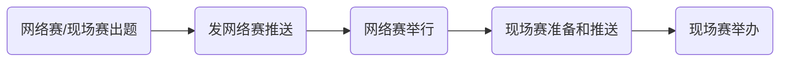

```mermaid
graph LR
a(网络赛/现场赛出题) --> b(发网络赛推送) --> c(网络赛举行) --> d(现场赛准备和推送) --> e(现场赛举办)
```

1. 出题：网络赛和现场赛都需要出题。
2. 网络赛/现场赛推送：向参赛者推送赛事信息。注意加粗或标红重要信息，如时间、地点和其他规则。
3. 网络赛举办：准备工作包括推送网络赛信息和完成题目出题及测试。比赛期间，需要有工作人员在后台监控，关注选手提问、查看代码正确性和特殊情况。如有问题，需发布公告并进行重判。
4. 现场赛举办：在后台关注比赛进程，如有问题，需发布公告并进行重判。