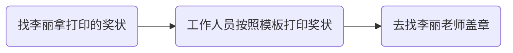

## 准备

各人员职责：

拍照：1血，集体，合影等

前台：进出登记，最后集中到一个教室，收手机，包裹

打气球和小票：有小票出来就去送气球，1血送漂浮的气球

打印小票：驱动下载，安装，设置

## 比赛时

将与比赛无关的东西放到前面（手机，书包）

不能用两台电脑,不能玩手机,不然直接当作弊处理

记得拍照

## 比赛后

### 报销

全部发票需要有学校抬头(确定一下是分校,校区,还是珠海市计算机学会)

然后费用要整理一个excel表,格式参考前几年

反面需要3个人签字,申报人签一个字,然后找两个老师签字(ymj,wxy)

直接去找尹飞老师
1. 报销都需要发票,且所有发票都需要学校抬头(一般来说,具体看要求),需要纸质发票,电子版的打印A4纸张
2. 在每张发票背后写上什么比赛什么用途,如果涉及到午晚餐需要写清楚一共有多少个人
3. 每张发票背后都需要2个老师(一般是系主任和指导老师)和经办人(即自己)签名
4. 把所有发票的金额整理成一个表格,具体格式可以参考往年,表格打印出后需要经办人和指导老师手写签名,最好让系主任也签字
5. 网上买东西的,需要订单截图(要看到交易流水号和实际支付金额)以及账单截图(支付宝 or  微信 or 银行卡的),订单截图和账单截图背面需要本人签字,然后去B608找胡老师盖学院章!
6. 把这些资料整理好,交到木铎A206尹飞老师那里
   注意:有些发票是新版发票,需要自己去 https://inv-veri.chinatax.gov.cn 查询信息,并打印出来,在上面写上"经查询,与原始发票信息一致",并签字.具体有哪些是新版发票,我也不确定,老师说是的话就是.

上述第三条,也可以不用自己签名,找3个老师签名

### 选手奖金和出题费

这个也要和上面那个报销的一起进行,需要收集选手/出题人的信息,具体格式参考去年的

### 新闻稿

直接参考一下去年的,改一下即可

### 历届传统-吃饭

看情况了,有一届预算是500吃饭

可以去关东人家,也可以买蛋糕什么的回来吃

### 选手奖状打印

> 模板去前几年的文件夹里找
>
> 盖章需要证明,需要打印名单然后找(ymj/wxy)老师签名,把签完字的名单给李丽看才能盖章

### 需要的文件

看老师的需要了,后续可能会改动,这是某一届老师需要的文件

- 劳务费发放表:用来发劳务费的
- 农业银行批量转账表
- 发放清册
- 获奖证书信息收集表

